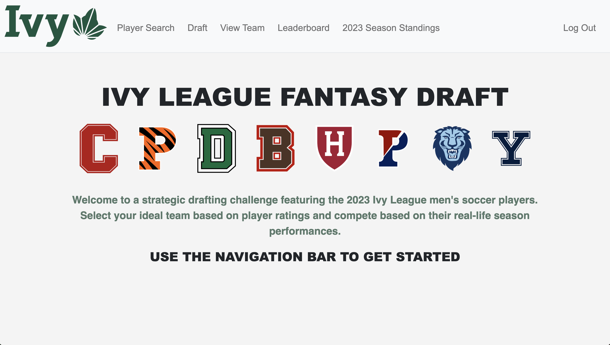
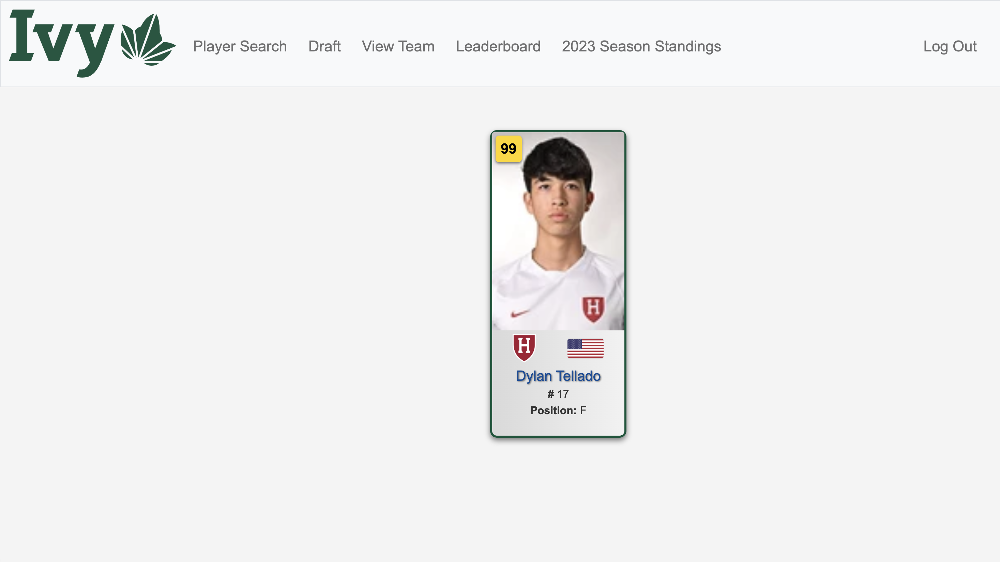
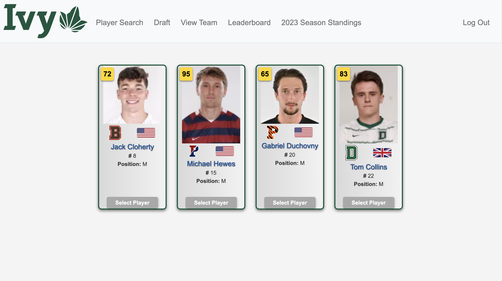
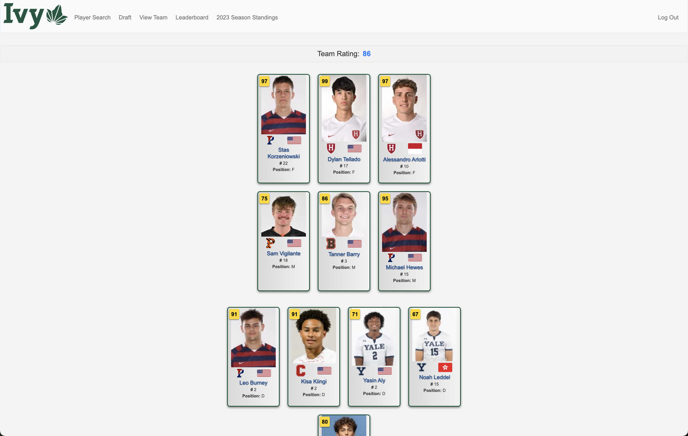

# Ivy League Fantasy Draft Website

## Link to Video Demonstration
https://youtu.be/WuBXXSHmV_c

## Introduction
This project is a web-based implementation of FIFA's FUT Draft game mode with an Ivy League twist. Users can create an account, draft their own team, and compete in a leaderboard ranking.

## Overview

The **Ivy League Fantasy Draft Website** offers an engaging experience where users can **search for Ivy League players**, draft a **fantasy team**, and compare their team’s performance on a **leaderboard**.

### **Homepage**
The **homepage** provides a clear and organized interface, offering quick access to the **Player Search**, **Draft**, **View Team**, and **Leaderboard** sections. It serves as a simple starting point for navigating all features of the platform.

### **Player Search Feature**
The **player search** feature allows users to **search for Ivy League players** by name. The search results display **dynamic player cards** with detailed **player information** and **ratings** calculated from **real-time performance statistics** from the **2023 season**.

### **Player Selection for Drafting**
On the **Draft Page**, users can select players to build their ideal fantasy team. The player cards display **performance ratings**, **positions**, **nationalities**, and **college affiliations**.

### **Team Drafting Interface**
The **team drafting interface** shows the selected players, allowing users to **finalize and save** their team. The **team rating** provides immediate feedback on the strength of the drafted team.

## Features
- **User Accounts**: Secure sign-up and authentication system to manage user sessions.
- **Team Drafting**: Users can draft their team from a roster of Ivy League players from the 2023 season.
- **Player Ratings**: Players are rated using an algorithm that evaluates their real life performance data from the 2023 season.
- **Dynamic Player Cards**: Player information is displayed on cards created by scraping Ivy League school websites.
- **Player Search**: Users can search for Ivy League players by name to view their cards and stats.
- **Save Drafted Team**: Users can save their drafted teams for future reference.
- **Leaderboard**: Features a leaderboard displaying the teams with the highest ratings, including usernames and team ratings, sorted from highest to lowest.
- **Season Standings**: Users can view the standings from the 2023 Ivy League season through an embeded site

## Setup and Installation
1. Unzip the file.
2. Install the cs50 library with 'pip install cs50'
3. Ensure that the Flask-Session extension is installed in your environment with 'pip install Flask-Session'
4. Install the required Python packages with `pip install pycountry'.
5. Start the Flask server using `flask run`.
6. Access the website by navigating to the link displayed after 'Running on' in your terminal.

## Usage
- Sign up for an account and log in.
- Use the search feature to find and view player cards.
- Navigate to the draft page to draft your team and save it to your profile.
- Check the leaderboard to see how your team compares to others.

## Technologies Used
- **Frontend**: HTML, CSS, JavaScript
- **Backend**: Python with Flask
- **Database**: SQLite3
- **Web Scraping**: Python libraries such as BeautifulSoup and Requests
- **Deployment**: TBD

